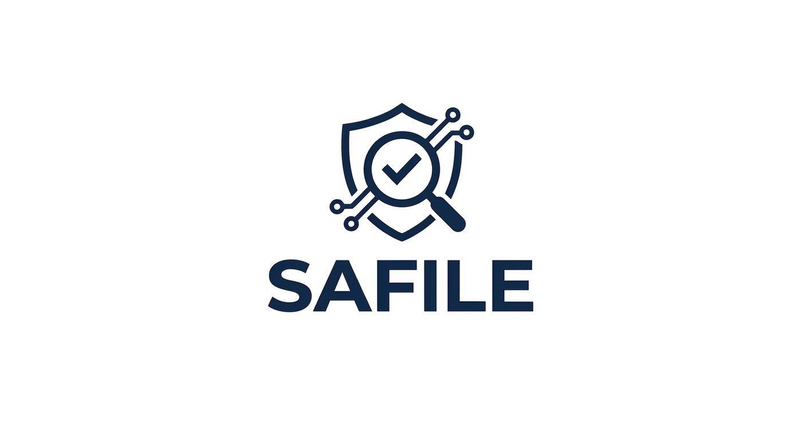
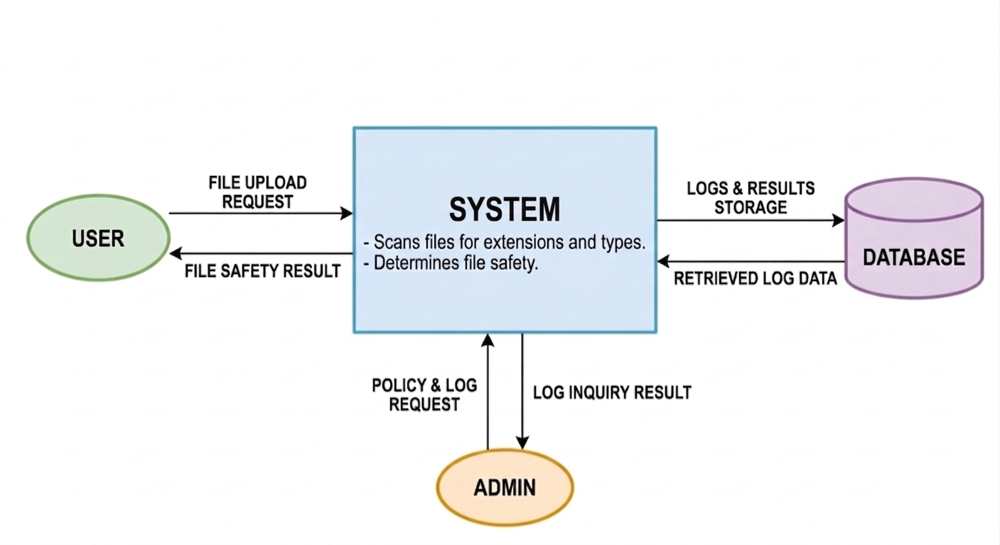

# **SAFILE**

### **Student No** 22412410  
### **Name** 황선영  
### **E-Mail** 0xsy54@gmail.com  

 

---

## [ Revision history ]

| Revision date | Version # | Description | Author |
| --- | --- | --- | --- |
| 03/27/2026 | 1.00 | First draft | 황선영 |
| 05/08/2026 | 1.01 | Use case list 및 Concept of operation 일부 수정 | 황선영 |
---

## **= Contents =**

1. [Business purpose](#1-business-purpose)  
2. [System context diagram](#2-system-context-diagram)  
3. [Use case list](#3-use-case-list)  
4. [Concept of operation](#4-concept-of-operation)  
5. [Problem statement](#5-problem-statement)  
6. [Glossary](#6-glossary)  
7. [References](#7-references)  

---

# **1. Business purpose**

최근 웹 서비스에서는 파일 업로드 기능이 기본적으로 제공되고 있으며, 사용자들은 이미지, 문서, 과제 파일 등 다양한 형태의 파일을 시스템에 업로드하고 있다. 이러한 기능은 서비스 이용의 편의성을 높이는 중요한 요소이지만, 동시에 보안 취약점으로 악용될 가능성도 존재한다.  

특히 일반 사용자들은 파일의 확장자를 기준으로 파일의 안전성을 판단하는 경우가 많다. 예를 들어 PDF나 한글 파일과 같이 익숙한 확장자를 보고 안전하다고 생각하는 경우가 많지만, 실제로는 확장자를 변형하거나 위장한 악성 파일일 가능성도 존재한다. 전산 지식이 부족한 사용자일수록 이러한 위장 파일을 구분하기 어렵고, 심지어 일정 수준의 지식을 가진 사용자라도 변형된 파일을 직관적으로 판단하기는 쉽지 않다.  

실제로 보안 관련 사례를 보면, 사용자를 악성 웹사이트로 유도하기 위해 정상 파일처럼 보이는 첨부파일이나 링크를 활용하는 공격이 발생하고 있다. 사용자는 이를 정상적인 파일로 인식하고 실행하게 되며, 그 결과 악성 사이트 접속이나 추가적인 피해로 이어질 수 있다. 이러한 공격 방식은 단순하지만 효과적이기 때문에 지속적으로 활용되고 있는 문제점이다.  

또한 일부 시스템에서는 파일 업로드 시 별도의 검증 없이 파일을 저장하거나, 단순한 확장자 검사만 수행하는 경우가 존재한다. 이러한 방식은 확장자를 변경한 파일이나 위장된 파일을 제대로 탐지하지 못한다는 한계를 가진다.  

본 프로젝트는 이러한 문제를 해결하기 위해, 파일 업로드 시 파일의 안전 여부를 사전에 판단할 수 있는 시스템을 구현하는 것을 목적으로 한다. 확장자 검사뿐만 아니라 MIME 타입을 함께 확인하여 파일의 실제 형식을 검증하고, 이를 통해 기본적인 수준에서 위험 파일을 구분할 수 있도록 한다.  

본 시스템의 이름은 SAFILE로, “Safe”와 “File”의 합성어이다. 이는 사용자가 업로드하는 파일의 안전성을 확인하고 보다 안전하게 파일을 관리할 수 있도록 돕는다는 의미를 담고 있다. 이름 자체가 시스템의 목적을 직관적으로 나타내며, 사용자가 쉽게 이해할 수 있도록 설계되었다.  

결론적으로, 본 프로젝트는 파일 업로드 과정에서 발생할 수 있는 보안 위험을 줄이고, 사용자가 보다 안전하게 파일을 다룰 수 있도록 지원하는 것을 목표로 한다.  

---

# **2. System context diagram**

### **1. 사용자(User) 관련**
- **File Upload Request**: 분석할 파일을 시스템에 전송
- **File Safety Result**: 시스템으로부터 파일의 안전 여부 수신

### **2. 관리자(Admin) 관련**
- **Policy & Log Request**: 보안 규칙 설정 및 로그 조회 요청
- **Log Inquiry Result**: 요청한 로그 및 통계 데이터 수신

### **3. 저장소(Database) 관련**
- **Logs & Results Storage**: 검사 완료된 데이터와 로그를 DB에 기록
- **Retrieved Log Data**: 관리자 요청 시 저장된 로그를 시스템으로 불러옴

---

# 3. Use case list

## 1) User Sign Up

| Actor | User |
| --- | --- |
| Description | 사용자가 시스템 계정을 생성한다. |

## 2) User Login

| Actor | User |
| --- | --- |
| Description | 사용자가 시스템에 로그인한다. |

## 3) Upload File

| Actor | User |
| --- | --- |
| Description | 사용자가 검사할 파일을 업로드한다. |

## 4) View Upload Result

| Actor | User |
| --- | --- |
| Description | 업로드된 파일의 검사 결과(SAFE / WARNING / BLOCKED 및 위험도)를 확인한다. |

## 5) Check Blocking Reason

| Actor | User |
| --- | --- |
| Description | 차단된 파일의 차단 사유를 확인한다. |

## 6) View Upload History

| Actor | User |
| --- | --- |
| Description | 사용자가 자신의 업로드 기록을 조회한다. |

## 7) Check Upload Policy

| Actor | User |
| --- | --- |
| Description | 파일 허용/차단 정책 및 위험 기준을 확인한다. |

## 8) View Security Alert

| Actor | User |
| --- | --- |
| Description | 위험 파일 탐지 시 보안 경고 메시지를 확인한다. |

## 9) Delete Upload History

| Actor | User |
| --- | --- |
| Description | 사용자가 업로드 기록을 삭제한다. |

---

# 4. Concept of operation

---

## 1) User Sign Up

| Purpose | 사용자가 시스템 계정을 생성할 수 있도록 한다. |
| --- | --- |
| Approach | 사용자가 이메일, 아이디, 비밀번호 정보를 입력하면 시스템이 입력값을 검증한 후 계정을 생성한다. 중복 아이디 여부를 확인하고 성공 시 회원가입을 완료한다. |
| Dynamics | 회원가입 요청 시 |
| Goals | 사용자 계정 생성 기능 구현 |

---

## 2) User Login

| Purpose | 사용자가 시스템에 로그인할 수 있도록 한다. |
| --- | --- |
| Approach | 사용자가 입력한 아이디와 비밀번호를 서버에서 검증하여 인증 성공 시 세션을 생성하고 메인 화면으로 이동한다. 실패 시 오류 메시지를 반환한다. |
| Dynamics | 로그인 요청 시 |
| Goals | 사용자 인증 기능 구현 |

---

## 3) Upload File

| Purpose | 사용자가 파일을 시스템에 업로드할 수 있도록 한다. |
| --- | --- |
| Approach | 사용자가 파일을 선택하여 업로드하면 시스템이 파일을 서버로 전송하고 기본 정보(이름, 크기, 타입)를 수집한다. 이후 보안 검사 단계로 전달된다. |
| Dynamics | 파일 업로드 시 |
| Goals | 파일 업로드 기능 구현 |

---

## 4) View Upload Result

| Purpose | 업로드된 파일의 검사 결과를 사용자에게 제공한다. |
| --- | --- |
| Approach | 시스템이 검사 결과(SAFE / WARNING / BLOCKED)와 위험도(LOW / MEDIUM / HIGH)를 조회하여 사용자에게 출력한다. |
| Dynamics | 검사 완료 후 |
| Goals | 검사 결과 제공 기능 구현 |

---

## 5) Check Blocking Reason

| Purpose | 차단된 파일의 이유를 사용자에게 제공한다. |
| --- | --- |
| Approach | 파일이 BLOCKED 상태일 경우 확장자, MIME 타입 불일치, 정책 위반 여부 등의 차단 사유를 조회하여 출력한다. |
| Dynamics | 차단 파일 조회 시 |
| Goals | 차단 사유 제공 기능 구현 |

---

## 6) View Upload History

| Purpose | 사용자가 업로드 이력을 확인할 수 있도록 한다. |
| --- | --- |
| Approach | 시스템이 사용자 기준으로 업로드된 파일 목록과 검사 결과를 조회하여 출력한다. |
| Dynamics | 기록 조회 요청 시 |
| Goals | 업로드 기록 조회 기능 구현 |

---

## 7) Check Upload Policy

| Purpose | 파일 보안 정책을 사용자에게 제공한다. |
| --- | --- |
| Approach | 허용 확장자, 차단 확장자, 위험도 기준 등을 조회하여 사용자에게 출력한다. |
| Dynamics | 정책 조회 시 |
| Goals | 보안 정책 조회 기능 구현 |

---

## 8) View Security Alert

| Purpose | 위험 파일 탐지 시 경고 메시지를 제공한다. |
| --- | --- |
| Approach | 시스템이 위험 파일을 탐지하면 경고 메시지와 함께 업로드 제한 안내를 사용자에게 출력한다. |
| Dynamics | 위험 파일 탐지 시 |
| Goals | 보안 경고 기능 구현 |

---

## 9) Delete Upload History

| Purpose | 사용자가 업로드 기록을 삭제할 수 있도록 한다. |
| --- | --- |
| Approach | 사용자가 선택한 업로드 기록을 시스템에서 삭제하고 결과를 반환한다. 삭제 실패 시 오류 메시지를 출력한다. |
| Dynamics | 삭제 요청 시 |
| Goals | 기록 삭제 기능 구현 |
---

# **5. Problem statement**

현재 많은 웹 서비스에서는 파일 업로드 기능을 제공하고 있지만, 보안 검사가 충분하지 않은 경우가 많다. 단순히 확장자만 검사하거나 별도의 검증 없이 파일을 저장하는 경우도 존재한다.  

이러한 방식은 악성 파일 업로드 공격에 취약하며, 서버 해킹이나 데이터 유출과 같은 문제로 이어질 수 있다. 특히 확장자를 변경한 파일은 단순한 검사 방식으로는 탐지하기 어렵다.  

또한 본 시스템은 웹 기반으로 동작하기 때문에 네트워크 환경에 영향을 받는다. 인터넷 연결이 가능한 환경에서만 파일 업로드 및 검사 기능을 사용할 수 있으며, 네트워크 상태에 따라 서비스 이용에 제한이 발생할 수 있다.  

또한 파일 검사를 수행하는 과정에서 성능 문제도 고려해야 한다. 검사 시간이 길어질 경우 사용자 경험이 저하될 수 있으며, 여러 요청이 동시에 발생할 경우 처리 지연이 발생할 수 있다.  

따라서 본 시스템은 기본적인 보안 기능을 유지하면서도, 안정적이고 효율적인 동작을 고려하여 설계될 필요가 있다.  

- 파일 검사 결과는 3초 이내에 제공되어야 한다.  
- 시스템은 안정적으로 동작해야 하며 오류 없이 실행되어야 한다.  
- 검사 결과는 일관되게 제공되어야 한다.  
- 사용자가 쉽게 파일을 업로드하고 결과를 확인할 수 있도록 직관적인 인터페이스를 제공해야 한다.  
- 파일 검사 결과 및 로그 데이터는 정확하게 저장되어야 한다.  
- 데이터 손실이나 오류가 발생하지 않도록 관리되어야 한다.  

---

# **6. Glossary**

| Term | Description |
|---|---|
| 파일 업로드 | 사용자가 파일을 시스템에 전송하는 과정 |
| 확장자 | 파일의 형식을 나타내는 정보 |
| MIME 타입 | 파일의 실제 형식 정보 |
| 로그 | 시스템 기록 데이터 |
| 악성 파일 | 시스템에 피해를 줄 수 있는 코드를 포함한 파일 |
| 위험 파일 | 명확한 악성은 아니지만 보안상 문제가 될 가능성이 있는 파일 |
| 로그 | 시스템에서 발생한 작업이나 이벤트를 기록한 데이터 |
| 데이터베이스 | 파일 검사 결과 및 로그 데이터를 저장하는 공간 |

---

# **7. References**

- 보안뉴스, “파일 업로드 취약점 및 악성 파일 공격 사례”  
  https://www.boannews.com/media/view.asp?idx=131817

- OWASP, “Unrestricted File Upload Vulnerability”  
  https://owasp.org/www-community/vulnerabilities/Unrestricted_File_Upload
