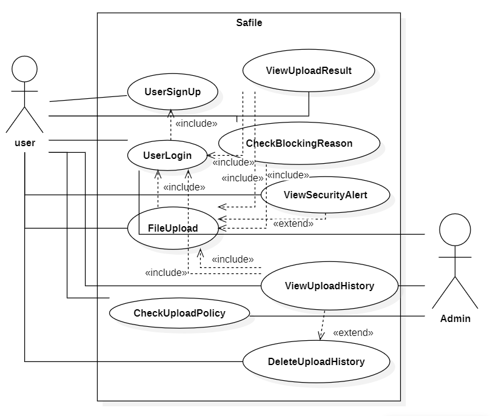
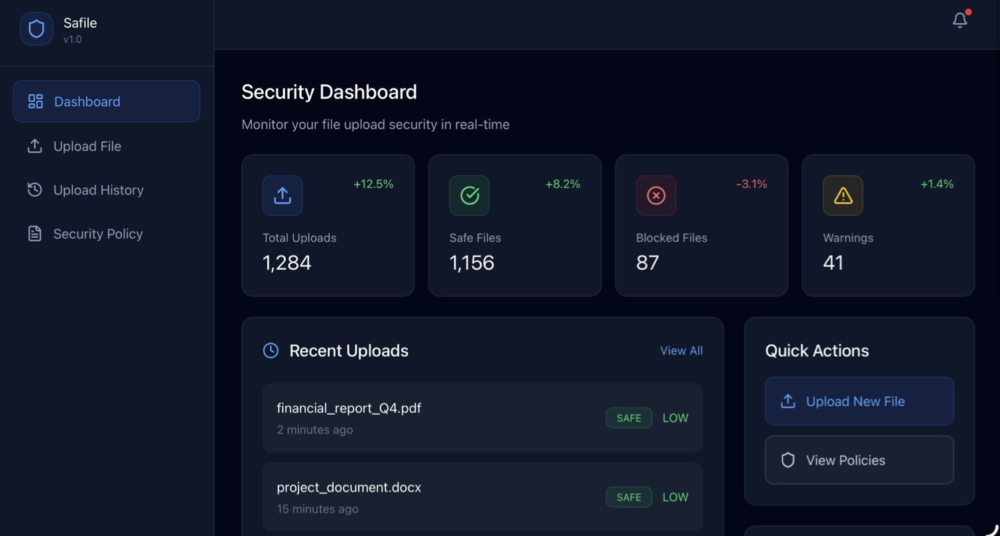
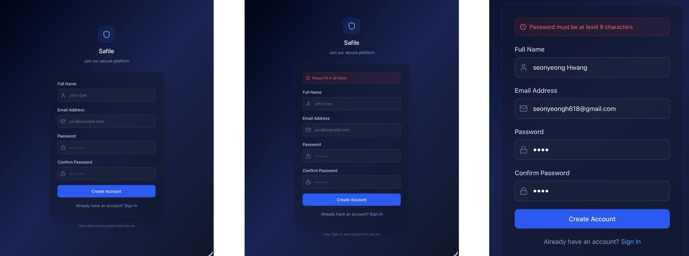
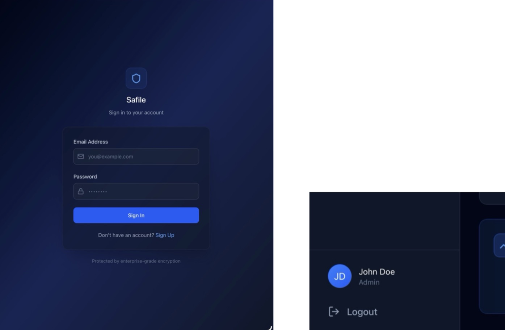
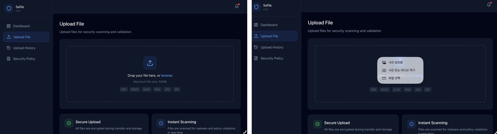
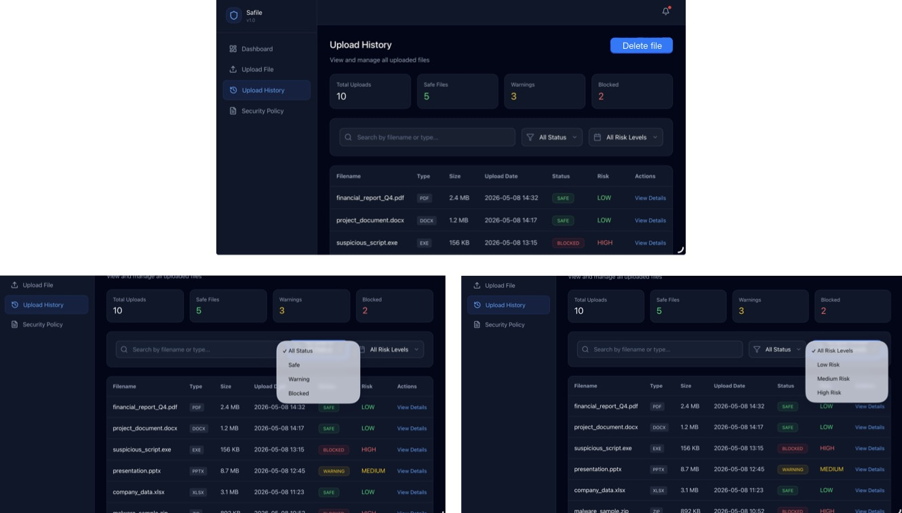
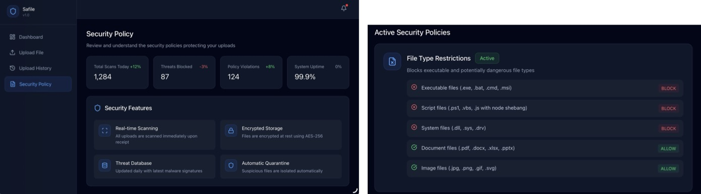

# **SAFILE**

### **Student No** 22412410  
### **Name** 황선영  
### **E-Mail** 0xsy54@gmail.com  

 

---
# Analysis

### [ Revision history ]

| Revision date | Version # | Description | Author |
| --- | --- | --- | --- |
| 2026.05.08 | 1.0.0 | First Draft |  |
| 2026.06.05 | 1.0.1 |  클래스 오타 수정|  |
|  |  |  |  |
|  |  |  |  |
|  |  |  |  |

---

# 1. Introduction

최근 웹 서비스에서는 파일 업로드 기능이 다양한 환경에서 사용되고 있다.  
예를 들어 과제 제출 시스템, 커뮤니티 게시판, 클라우드 저장소, 메신저 첨부파일 서비스 등 대부분의 웹 애플리케이션은 파일 업로드 기능을 제공한다.

하지만 파일 업로드 기능은 웹 보안 측면에서 매우 위험한 취약점이 될 수 있다. 공격자는 악성 실행 파일(.exe), 스크립트 파일(.php, .js), 또는 이중 확장자 파일(example.pdf.exe)과 같은 위험 파일을 업로드하여 서버 공격, 악성코드 실행, 정보 유출 등의 보안 문제를 발생시킬 수 있다.

본 프로젝트 “Safile”은 안전한 파일 업로드 환경을 제공하기 위한 보안 기반 웹 시스템이다. 사용자가 업로드한 파일의 확장자 및 파일 패턴을 검사하여 위험 파일 여부를 판단하고, 보안 정책에 따라 업로드를 허용하거나 차단한다. 또한 시스템은 위험 파일 탐지 결과, 차단 사유, 보안 경고 메시지 등을 사용자에게 제공하여 파일 업로드 과정에서 발생할 수 있는 보안 위협을 감소시키는 것을 목표로 한다.

Safile은 Flask 기반 웹 애플리케이션으로 구현되며, 로그인 시스템, 파일 업로드 기능, 업로드 기록 관리, 보안 정책 확인 기능 등을 포함한다. 또한 보안 중심의 대시보드 UI를 통해 사용자 친화적이면서도 실제 보안 서비스와 유사한 환경을 제공하도록 설계하였다.
# 2. Use case analysis

---

## 2.1 Use case diagram

---

## 2.2 Use case description

---

# Use Case #1 : User Login

## GENERAL CHARACTERISTICS

| 항목 | 내용 |
| --- | --- |
| Summary | 사용자가 시스템에 로그인한다. |
| Scope | Safile |
| Level | User Level |
| Author | 황선영 |
| Last Update | 2026-05-08 |
| Status | Analysis |
| Primary Actor | User |
| Preconditions | 사용자는 회원가입이 완료되어 있어야 한다. |
| Trigger | 사용자가 로그인 메뉴를 선택한다. |
| Success Post Condition | 사용자가 시스템에 정상 로그인된다. |
| Failed Post Condition | 로그인에 실패하고 오류 메시지가 출력된다. |

---

## MAIN SUCCESS SCENARIO

| Step | Action |
| --- | --- |
| S | 로그인 기능이 실행된다. |
| 1 | 사용자가 아이디와 비밀번호를 입력한다. |
| 2 | 시스템이 입력 정보를 확인한다. |
| 3 | 인증이 성공하면 메인 화면으로 이동한다. |

---

## EXTENSION SCENARIOS

| Step | Branching Action |
| --- | --- |
| 2 | 2a. 아이디 또는 비밀번호가 틀린 경우 |
|  | 2a.1. 로그인 실패 메시지를 출력한다. |
|  | 2a.2. 로그인 화면으로 돌아간다. |

---

## RELATED INFORMATION

| 항목 | 내용 |
| --- | --- |
| Performance | ≤ 3 Seconds |
| Frequency | High |
| Concurrency | Multiple Users |
| Due Date | 2026-06-15 |

---

# Use Case #2 : File Upload

## GENERAL CHARACTERISTICS

| 항목 | 내용 |
| --- | --- |
| Summary | 사용자가 검사할 파일을 업로드한다. |
| Scope | Safile |
| Level | User Level |
| Author | 황선영 |
| Last Update | 2026-05-08 |
| Status | Analysis |
| Primary Actor | User |
| Preconditions | 사용자가 로그인되어 있어야 한다. |
| Trigger | 사용자가 파일 업로드 메뉴를 선택한다. |
| Success Post Condition | 파일이 시스템에 업로드된다. |
| Failed Post Condition | 파일 업로드가 실패한다. |

---

## MAIN SUCCESS SCENARIO

| Step | Action |
| --- | --- |
| S | 파일 업로드 기능이 실행된다. |
| 1 | 사용자가 업로드할 파일을 선택한다. |
| 2 | 사용자가 업로드 버튼을 클릭한다. |
| 3 | 시스템이 파일을 서버로 전송한다. |
| 4 | 업로드가 완료된다. |

---

## EXTENSION SCENARIOS

| Step | Branching Action |
| --- | --- |
| 1 | 1a. 파일을 선택하지 않은 경우 |
|  | 1a.1. 파일 선택 메시지를 출력한다. |
|  | 1a.2. 업로드 화면으로 돌아간다. |

---

## RELATED INFORMATION

| 항목 | 내용 |
| --- | --- |
| Performance | ≤ 5 Seconds |
| Frequency | Very High |
| Concurrency | Multiple Users |
| Due Date | 2026-06-15 |

---

# Use Case #3 : View Upload Result

## GENERAL CHARACTERISTICS

| 항목 | 내용 |
| --- | --- |
| Summary | 업로드한 파일의 검사 결과, 허용 여부(SAFE/WARNING/BLOCKED), 위험도(LOW/MEDIUM/HIGH)를 확인한다. |
| Scope | Safile |
| Level | User Level |
| Author | 황선영 |
| Last Update | 2026-05-08 |
| Status | Analysis |
| Primary Actor | User |
| Preconditions | 파일 업로드가 완료되어 있어야 한다. |
| Trigger | 시스템이 파일 검사를 완료한다. |
| Success Post Condition | 검사 결과가 사용자에게 출력된다. |
| Failed Post Condition | 검사 결과를 불러오지 못한다. |

---

## MAIN SUCCESS SCENARIO

| Step | Action |
| --- | --- |
| S | 검사 결과 확인 기능이 실행된다. |
| 1 | 시스템이 파일 검사 결과를 조회한다. |
| 2 | 허용 또는 차단 여부를 출력한다. |
| 3 | 위험도 및 결과 메시지를 출력한다. |

---

## EXTENSION SCENARIOS

| Step | Branching Action |
| --- | --- |
| 1 | 1a. 검사 결과가 존재하지 않는 경우 |
|  | 1a.1. 결과 조회 실패 메시지를 출력한다. |

---

## RELATED INFORMATION

| 항목 | 내용 |
| --- | --- |
| Performance | ≤ 3 Seconds |
| Frequency | High |
| Concurrency | Multiple Users |
| Due Date | 2026-06-15 |

---

# Use Case #4 : Check Blocking Reason

## GENERAL CHARACTERISTICS

| 항목 | 내용 |
| --- | --- |
| Summary | 사용자가 파일 차단 사유를 확인한다. |
| Scope | Safile |
| Level | User Level |
| Author | 황선영 |
| Last Update | 2026-05-08 |
| Status | Analysis |
| Primary Actor | User |
| Preconditions | 파일이 차단되어 있어야 한다. |
| Trigger | 사용자가 차단 사유 확인을 선택한다. |
| Success Post Condition | 차단 사유가 출력된다. |
| Failed Post Condition | 차단 사유를 불러오지 못한다. |

---

## MAIN SUCCESS SCENARIO

| Step | Action |
| --- | --- |
| S | 차단 사유 확인 기능이 실행된다. |
| 1 | 시스템이 차단 사유를 조회한다. |
| 2 | 위험 확장자 여부를 출력한다. |
| 3 | 이중 확장자 탐지 여부를 출력한다. |

---

## EXTENSION SCENARIOS

| Step | Branching Action |
| --- | --- |
| 1 | 1a. 차단 사유 정보가 없는 경우 |
|  | 1a.1. 오류 메시지를 출력한다. |

---

## RELATED INFORMATION

| 항목 | 내용 |
| --- | --- |
| Performance | ≤ 3 Seconds |
| Frequency | Medium |
| Concurrency | Multiple Users |
| Due Date | 2026-06-15 |

---

# Use Case #5 : View Upload History

## GENERAL CHARACTERISTICS

| 항목 | 내용 |
| --- | --- |
| Summary | 사용자가 업로드 기록을 조회한다. |
| Scope | Safile |
| Level | User Level |
| Author | 황선영 |
| Last Update | 2026-05-08 |
| Status | Analysis |
| Primary Actor | User |
| Preconditions | 사용자가 로그인되어 있어야 한다. |
| Trigger | 사용자가 업로드 기록 조회를 선택한다. |
| Success Post Condition | 업로드 기록이 출력된다. |
| Failed Post Condition | 기록 조회에 실패한다. |

---

## MAIN SUCCESS SCENARIO

| Step | Action |
| --- | --- |
| S | 업로드 기록 조회 기능이 실행된다. |
| 1 | 시스템이 사용자 업로드 기록을 조회한다. |
| 2 | 업로드 파일 목록을 출력한다. |
| 3 | 검사 결과를 함께 출력한다. |

---

## EXTENSION SCENARIOS

| Step | Branching Action |
| --- | --- |
| 1 | 1a. 업로드 기록이 없는 경우 |
|  | 1a.1. 기록이 없다는 메시지를 출력한다. |

---

## RELATED INFORMATION

| 항목 | 내용 |
| --- | --- |
| Performance | ≤ 5 Seconds |
| Frequency | Medium |
| Concurrency | Multiple Users |
| Due Date | 2026-06-15 |

---

# Use Case #7 : Check Upload Policy

## GENERAL CHARACTERISTICS

| 항목 | 내용 |
| --- | --- |
| Summary | 사용자가 파일 위험 분류 기준 및 허용/차단 조건을 확인한다. |
| Scope | Safile |
| Level | User Level |
| Author | 황선영 |
| Last Update | 2026-05-08 |
| Status | Analysis |
| Primary Actor | User |
| Preconditions | 없음 |
| Trigger | 사용자가 Security Policy 메뉴를 선택한다. |
| Success Post Condition | 파일 분류 기준과 위험 파일 조건을 확인한다. |
| Failed Post Condition | 정책 정보를 불러오지 못한다. |

---

## MAIN SUCCESS SCENARIO

| Step | Action |
| --- | --- |
| S | 파일 정책 확인 기능이 실행된다. |
| 1 | 시스템이 허용 파일 형식을 조회한다. |
| 2 | 허용 및 차단 확장자를 출력한다. |
| 3 | 위험도 분류 기준을 출력한다. |

---

## RELATED INFORMATION

| 항목 | 내용 |
| --- | --- |
| Performance | ≤ 2 Seconds |
| Frequency | Low |
| Concurrency | Multiple Users |
| Due Date | 2026-06-15 |

---

# Use Case #8 : View Security Alert

## GENERAL CHARACTERISTICS

| 항목 | 내용 |
| --- | --- |
| Summary | 사용자가 위험 파일 경고 메시지를 확인한다. |
| Scope | Safile |
| Level | User Level |
| Author | 황선영 |
| Last Update | 2026-05-08 |
| Status | Analysis |
| Primary Actor | User |
| Preconditions | 위험 파일이 탐지되어야 한다. |
| Trigger | 시스템이 위험 파일을 탐지한다. |
| Success Post Condition | 보안 경고 메시지가 출력된다. |
| Failed Post Condition | 경고 메시지 출력에 실패한다. |

---

## MAIN SUCCESS SCENARIO

| Step | Action |
| --- | --- |
| S | 보안 경고 기능이 실행된다. |
| 1 | 시스템이 위험 파일 여부를 확인한다. |
| 2 | 위험 파일 경고 메시지를 출력한다. |
| 3 | 업로드 제한 안내를 출력한다. |

---

## RELATED INFORMATION

| 항목 | 내용 |
| --- | --- |
| Performance | ≤ 2 Seconds |
| Frequency | Medium |
| Concurrency | Multiple Users |
| Due Date | 2026-06-15 |

---

# Use Case #9 : User Sign Up

## GENERAL CHARACTERISTICS

| 항목 | 내용 |
| --- | --- |
| Summary | 사용자가 시스템 계정을 생성한다. |
| Scope | Safile |
| Level | User Level |
| Author | 황선영 |
| Last Update | 2026-05-08 |
| Status | Analysis |
| Primary Actor | User |
| Preconditions | 사용자가 기존 계정을 가지고 있지 않아야 한다. |
| Trigger | 사용자가 회원가입 메뉴를 선택한다. |
| Success Post Condition | 사용자 계정이 생성된다. |
| Failed Post Condition | 회원가입에 실패한다. |

---

## MAIN SUCCESS SCENARIO

| Step | Action |
| --- | --- |
| S | 회원가입 기능이 실행된다. |
| 1 | 사용자가 회원가입 정보를 입력한다. |
| 2 | 시스템이 입력 정보를 검증한다. |
| 3 | 사용자 계정을 생성한다. |
| 4 | 회원가입 완료 메시지를 출력한다. |

---

## EXTENSION SCENARIOS

| Step | Branching Action |
| --- | --- |
| 2 | 2a. 이미 존재하는 아이디인 경우 |
|  | 2a.1. 중복 아이디 메시지를 출력한다. |
|  | 2a.2. 회원가입 화면으로 돌아간다. |

---

## Use Case #11 : Delete Upload History

### GENERAL CHARACTERISTICS

| Item | Description |
| --- | --- |
| Summary | 사용자가 업로드 기록을 삭제한다. |
| Scope | Safile |
| Level | User Level |
| Author | 황선영 |
| Last Update | 2026-05-08 |
| Status | Analysis |
| Primary Actor | User |
| Preconditions | 삭제할 업로드 기록이 존재해야 한다. |
| Trigger | 사용자가 삭제 버튼을 선택한다. |
| Success Post Condition | 선택한 업로드 기록이 삭제된다. |
| Failed Post Condition | 업로드 기록 삭제에 실패한다. |

---

### MAIN SUCCESS SCENARIO

| Step | Action |
| --- | --- |
| S | 업로드 기록 삭제 기능이 실행된다. |
| 1 | 사용자가 삭제할 기록을 선택한다. |
| 2 | 삭제 버튼을 선택한다. |
| 3 | 시스템이 삭제 여부를 확인한다. |
| 4 | 업로드 기록을 삭제한다. |
| 5 | 삭제 완료 메시지를 출력한다. |

---

### EXTENSION SCENARIOS

| Step | Branching Action |
| --- | --- |
| 3 | 3a. 사용자가 삭제를 취소한 경우 |
|  | 3a.1. 삭제를 취소하고 이전 화면으로 돌아간다. |
| 4 | 4a. 삭제 처리 중 오류가 발생한 경우 |
|  | 4a.1. 삭제 실패 메시지를 출력한다. |

---

### RELATED INFORMATION

| Item | Description |
| --- | --- |
| Delete Target | Upload History Record |
| Performance | ≤ 3 Seconds |
| Frequency | Low |
| Concurrency | Multiple Users |
| Due Date | 2026-06-15 |
## 1) User

User 클래스는 시스템을 사용하는 일반 사용자 정보를 저장하고 관리하는 클래스이다.

사용자는 회원가입과 로그인을 통해 시스템에 접근할 수 있으며, 파일 업로드 및 업로드 이력 조회, 검색, 삭제 등의 기능을 수행한다.

또한 User는 업로드된 파일과 검사 결과를 확인할 수 있는 주체이다.

(예: userId, password, email 등의 정보를 포함한다.)

---

## 2) File

File 클래스는 사용자가 시스템에 업로드하는 파일 정보를 저장하는 클래스이다.

파일 이름, 파일 타입, 파일 크기, 업로드 시간 등의 정보를 포함하며, 업로드된 파일은 이후 보안 검사 시스템에 의해 분석된다.

이 클래스는 파일 검사 및 결과 생성의 기본 단위가 된다.

---

## 3) UploadRecord

UploadRecord 클래스는 사용자의 파일 업로드 이력을 저장하는 클래스이다.

각 사용자가 언제 어떤 파일을 업로드했는지 기록하며, 파일과 검사 결과를 연결하는 역할을 수행한다.

사용자는 이 클래스를 통해 자신의 업로드 기록을 조회하거나 검색 및 삭제할 수 있다.

---

## 4) ScanResult

ScanResult 클래스는 업로드된 파일에 대한 보안 검사 결과를 저장하는 클래스이다.

파일이 SAFE, WARNING, BLOCKED 중 어떤 상태인지 판단하며, 위험도(LOW, MEDIUM, HIGH)를 함께 저장한다.

또한 검사 결과의 상세 설명과 차단 여부를 포함한다.

---

## 5) SecurityPolicy

SecurityPolicy 클래스는 파일 업로드 시스템에서 적용되는 보안 규칙을 정의하는 클래스이다.

허용 확장자, 차단 확장자, 위험도 판단 기준 등을 포함하며, 시스템 전체의 파일 검사 기준을 제공한다.

사용자는 이 클래스를 통해 보안 정책 내용을 확인할 수 있다.

---

## 6) SecurityAlert

FileFilter 클래스는 업로드 결과를 조건별로 필터링하는 기능을 제공하는 클래스이다.

사용자는 SAFE, WARNING, BLOCKED 상태 또는 위험도 기준으로 결과를 조회할 수 있으며, 조건에 맞는 결과만 출력한다.

---
## 7) SecurityScanService
SecurityScanService 클래스는 파일의 확장자 및 이중 확장자 패턴을 정밀 검사하여 보안 위험도를 평가하는 기능을 담당하는 클래스이다.
입력받은 파일명과 보안 정책(SecurityPolicy)을 비교하여, 위협 요소 발견 시 상태(SAFE, WARNING, BLOCKED)와 위험 수준을 포함한 ScanResult 객체를 생성한다.

--- 
## 8) FileFilter
FileFilter 클래스는 업로드 결과를 조건별로 필터링하는 기능을 제공하는 클래스이다.
사용자는 SAFE, WARNING, BLOCKED 상태 또는 위험도 기준으로 결과를 조회할 수 있으며, 조건에 맞는 결과만 출력한다.
---

## 9) HistorySearch

HistorySearch 클래스는 사용자의 업로드 기록을 검색하는 기능을 담당하는 클래스이다.

파일 이름 또는 업로드 날짜를 기준으로 기록을 조회할 수 있으며, 검색 결과가 존재하지 않을 경우 메시지를 출력한다.

---

## 10) FileDeletion

FileDeletion 클래스는 사용자의 업로드 기록을 삭제하는 기능을 담당하는 클래스이다.

사용자가 선택한 업로드 기록을 시스템에서 제거하며, 삭제 성공 여부를 관리한다.

삭제 과정에서 오류가 발생할 경우 실패 메시지를 출력한다.

---

## 11) AuthenticationService

AuthenticationService 클래스는 사용자 인증을 담당하는 클래스이다.

회원가입 및 로그인 기능을 포함하며, 사용자의 아이디와 비밀번호를 검증하여 시스템 접근 권한을 부여한다.

인증 실패 시 오류 메시지를 반환한다.

---

- 사용자 관리 (User, AuthenticationService)
- 파일 관리 (File, UploadRecord)
- 보안 분석 (ScanResult, SecurityPolicy)
- 위험 처리 (SecurityAlert, BlockingReason)
- 조회/관리 기능 (Search, Filter, Delete)

---

> 이 시스템의 도메인 분석은 “사용자(User)가 파일(File)을 업로드하고, 시스템이 이를 검사(ScanResult)하여 결과를 기록(UploadRecord)하고 보안 정책(SecurityPolicy)에 따라 경고(SecurityAlert) 또는 차단(BlockingReason)을 수행하는 구조”로 정의된다.
# 4. User Interface prototype

---

## 1. Dashboard

이름과 이메일과 비밀번호와 비밀번호 재확인을 입력하고 Create Account 버튼을 클릭하면 회원가입이 완료된다.  
- 각 항목을 채우지 않고 버튼을 클릭할 경우 “Please fill in all fields”라는 경고 메시지가 출력된다.  
- 비밀번호가 8자리 미만인 경우 최소 8문자는 적으라는 경고 메시지가 출력된다.

---

## 2. Sign up

모든 화면의 좌측 하단에 로그인 버튼이 존재한다. 로그인 버튼을 클릭 시 로그인 화면으로 이동한다.  
회원가입한 이메일과 패스워드를 입력하여 로그인한다.

---

## 3. Sign in

모든 화면의 좌측 하단에 로그인 버튼이 존재한다. 로그인 버튼을 클릭 시 로그인 화면으로 이동한다.  
회원가입한 이메일과 패스워드를 입력하여 로그인한다.

---

## 4. Upload file

사이드바에서 Upload File 버튼을 클릭 후 해당 화면으로 가서 파일 업로드 아이콘을 클릭하여 파일 형식(사진 보관함, 사진 또는 비디오 추가, 파일 선택) 선택 후 파일을 업로드 한다.

---

## 5. Upload History

현재까지 업로드 된 파일 항목을 볼 수 있다. 총 업로드 수, Safe files 수, warnings 수, blocked 수 등에 대해서 직관적으로 볼 수 있다.

---

## 6. Security Policy

어떤 확장자는 Block되고 어떤 확장자는 Allow되는지 정리되어있다.

# 5. Glossary

| 용어 | 영문 | 설명 |
| --- | --- | --- |
| 위험도 | Risk Level | 파일 위험 수준 |
| 낮은 위험도 | LOW | 위험 가능성이 낮은 상태 |
| 중간 위험도 | MEDIUM | 주의가 필요한 상태 |
| 높은 위험도 | HIGH | 위험이 높은 상태 |
| 보안 경고 | Security Alert | 위험 파일 경고 메시지 |
| 차단 사유 | Blocking Reason | 파일 차단 이유 |
| 파일 정책 | File Policy | 허용/차단 기준 |
| 허용 확장자 | Allowed Extension | 업로드 허용 확장자 |

---

